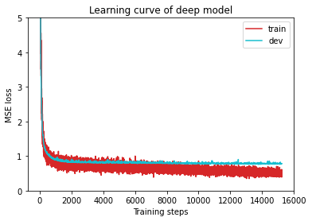
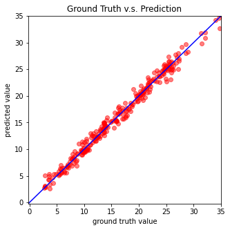

# ML 入門 & SageMaker 

這裡會簡單講一下 ML 的概念與步驟

| 步驟    |  定義問題|取得資料|選擇模型、選擇超參數|開始訓練|應用模型|
| ----------- | ----------- | ----------- | ----------- | ----------- | ----------- |
|   AWS 資源   | [自行判斷](https://docs.aws.amazon.com/sagemaker/latest/dg/autopilot-problem-types.html)|自行取得|SageMaker Autopilot|SageMaker Notebook Instace/Studio/Autopilot|Endpoint Deploy/ Neo compile model + Setup environment on edge devices|

* [SageMaker Studio & Autopilot demo](./SageMakerStudio_AutoPilot)
* [SageMaker Notebook instance demo](./SageMakerNB)
* SageMaker inferecing on edge devices with Neo
    1. [Compile model with Neo](./Model_to_NeoCompiled_Model)
    2. [Setup edge device to run model](./Neo_on_edge_devices)

## ML的概念

簡單來說，可以把 ML 想成尋找一個特定的"函數" (也就是 **模型** **model**)，而這個函數可能是吃聲音資訊，輸出一個人名 (語音辨識) 、或是吃一張圖片，輸出一個物品名稱 (影像辨識)。

ML 下面有幾個大類別，這幾個類別下都有不同的演算法，分別是

* Supervised learning: 這是比較常拿來被應用的類別。簡單來說就是我們需要機器幫我們學習到的東西是人類已經定義過標準答案的東西，比如今天輸入狗跟貓的圖片到機器，希望機器可以看到圖片知道是貓還是狗，我們就要先跟機器說哪一些照片是貓的照片哪些是狗的，也就是要先跟它講答案，這就屬於 Supervised learning

* Unsupervised learning: 在人類沒有給正確解答的資料下，自行讓機器在資料上學習，所以這部分的演算法會比較注重在資料分析

要細分的話還有許多類別，不過這邊就不提了

## ML 的流程

要找到一個能解決問題的模型大抵的流程是這樣。

 1. 定義問題
 2. 取得資料 (data)  
 3. 選擇模型、選擇超參數
 4. 開始訓練
 5. 應用模型

## 定義問題

今天如果要去用 ML 去解決一個問題，就要先去了解問題的內容是什麼，然後產出模型來解決問題，也就是把需要的資料丟入模型後，我們期望這個模型可以輸出什麼我們可以使用的結果。

一般而言，日常的 ML 應用比較常應用到的問題類別有兩種，一種是輸出一個數值，也就是 **回歸問題**，這時候就需要產出一個 **回歸模型** 去解決這個問題，例如: 想要預測明天 PM2.5數值，就需要一個預測明天 PM2.5 數值的模型，只要給這個模型今日 PM2.5 數值、今日溫度之類的數值當作輸入，最後就能輸出預測明天 PM2.5 的數值。衡量這種 **回歸模型** 的好壞通常是用 **loss** (想成誤差，雖然 loss 有很多不同算法) 來評斷，loss 要越小越好。

另一種是輸出一個類別，也就是 **分類問題**，需要一個 **分類模型** 來解決，例如: 垃圾電子郵件過濾系統是把電子郵件作為輸入，然後輸出是否為垃圾郵件的 yes or no，來解決垃圾郵件塞滿信箱的問題，這種屬於 binary classification，或是輸入一種動物圖片，模型輸出一種動物名稱，來幫忙辨別動物，這種就是 multi-class 的分類，而分類的好壞主要是看分類的 **正確率**。當然除了這兩大類問題與對應模型之外還有很多其他的問題，像是自動語音翻譯之類的，不過一般問題這兩種比較多。

## 取得資料 (data)  

資料在不要有太多錯誤資料 (像是可能感測器壞了所收到的數據跟實際不一樣或是有很多答案類別標錯的資料) 的前提下，資料當然是越多越好。

資料的形式是取決於問題，但是除非是影像方面的問題或是其他輸入資料，不然一般都是用數據的形式，然後用.csv檔包裝起來，有一些原本不是數字的 feature 也會轉成數字形式，例如今天有沒有下雨的是/否可能會定義是為 1 否為 0，不過具體仍然要看演算法的處理，如果這方面有疑問，網路上 ML 的資源其實很多，可以輕鬆找到別人處理同樣問題時的範例。

一般來說要訓練前通常會把資料分成專門丟入模型訓練的"**訓練資料**" (**training set**) 跟 訓練模型完畢後測試模型用的 "**測試資料**" (**validation set**/**development set**) 以避免 **overfit** (在訓練資料上跑時結果很好但是實際應用很差，可以看這裡對於 [overfit 與 underfit 的解釋](https://www.ibm.com/cloud/learn/overfitting))，至於要怎麼分可以自己視資料大小決定。

另外，資料在倒入模型訓練之前，也可以視情況選擇對資料進行前處理 (**pre-process**) ，一個好的前處理可以使訓練更有效率也增加模型成效，要注意若訓練時有用前處理資料，最後實際應用時也要用相同的前處理流程處理完資料才能丟入模型中應用。

## 選擇模型、選擇超參數

這部分算是比較困難的，模型的選擇跟參數的選擇沒有一定，由於模型訓練很費時，很難知道對於某一個問題中最佳模型及參數選擇，所以這邊來講解一些常聽到的術語

關於 ML 會用到的模型可以讀一下[這裡](https://towardsdatascience.com/5-minutes-cheat-sheet-explaining-all-machine-learning-models-3fea1cf96f05)

* CNN (Convolution Neural Network): 一個 Neural Network(一種模型) 的分支，普遍用在影像處理

* Pytorch/TensorFlow 是什麼? Ans: ML 用的 framework，至於這兩個 framework 最大的特點就是數據會被打包成 tensor ，可以用 gpu 做運算，比較快，其他還有一些特別的 framework，像是 XGboost 是對於針對某一種演算法去優化過的，其他都大同小異

* Jupyter Notebook: ML 現在基本上都是用 Python 來跑的，而 Jupyter Notebook 可以想成可以寫筆記，容易 debug 的一個寫 Python 的工具，基本上應該很好上手

這裡的 **超參數**  (**hyperparameter**) 主要是包含模型當中的架構選擇 (e.g. 神經網絡模型中要有幾層或每層要有幾個神經元) 還有訓練時要指定的參數 (e.g. 訓練時要對訓練資料跑過幾次訓練)

至於為什麼要有 **超參數** 這個名詞出現是因為要跟訓練模型時要調的 **參數** (parameter) 做一個區別，訓練時不是訓練模型的架構，模型的架構在訓練前架起來的時候就已經確定了，訓練時是訓練模型當中每一個節點的參數數值。

## 訓練與測試

訓練這邊在 AWS SageMaker 除了在 SageMaker Studio 上可以自動之外，在 SageMaker notebook instance 上也可以直接 call  相關 library 自動訓練。不過這裡還是講一下一些基本名詞解釋以及簡單數學意義。

- **ground truth**: 指一個資料的標籤，也就是要給機器看的標準答案，例如如果要訓練一個動物辨別系統，一個狗的照片的 ground truth 就可能是 "dog"

- **batch**: 訓練時通常不會一筆資料一筆資料的看，因為太費時了，所以通常是一組一組資料的看，這一組一組的每一組就叫 batch

- **epoch**: 訓練時，若每一個 batch 都被看過了一次，就算一個 epoch

- **loss function**: 可以想成訓練時每個 batch 丟進去模型跟 ground truth 的誤差，要注意 loss function 是以參數作為輸入的函數

- **optimizer**: 要進行 optimization 的演算法，ML 的 optimization 可以想成調整參數的方法

- **inference**: 模型訓練完後，給予 live 的資料，進行實際應用

 至於 ML 的數學意義可以想像在一個參數空間中我們想要找到一組參數能使 **loss function** 達到最小，於是我們每看過一個 **batch** 都去計算 **loss function** ，然後對 **loss funtion** 做微分就會大致知道參數往哪個方向調整會使 **loss function** 變小，並根據 **optimizer** 去調整改參數的方向。

在訓練時我們可能會有需求去監控模型的訓練，此時之前分割的訓練資料跟測試資料就能發生拿來使用，一般而言，訓練一個段落後，例如每 10 epoch，我們可能會選擇 output 模型對訓練資料目前的誤差或準確率，一個更大的段落後，例如每 50 epoch 會選擇把模型拿來對測試資料做測試並 output 一個誤差或準確率。這邊值得注意的是，雖然模型在訓練資料上的結果對於模型在測試資料上的結果往往有正相關，但是有時仍然可能在訓練資料上模型結果進步了但是測試資料上模型結果變差，這就是 overfit 的情況，不過補充一下，並不是只要在訓練資料上的結果比較好都是 overfit，通常是在實際應用時結果差到模型不堪用才會說是 overfit。

至於訓練的時間要多長? 一般來說會有幾種方法定義，第一種是設置要訓練的 epoch 數字，例如說跑個 100 epoch 就結束，或是規定參數調整 (training step) 10000 次後就結束都是選項內，另外還有可能設置 early stop 提前設置結束訓練的條件來避免 overfit 的發生，像是設置模型只要在測試資料上的結果優於某個門檻，訓練就結束，也是常常看見的訓練設置。

訓練結束後我們一般會用模型對測試資料的結果當作它表現的一個證明，訓練時也可以用一些輔助作圖 library 像是 Matplotlib 來視覺化訓練過程與結果

像是誤差跟訓練時間的關係圖

或是最終模型在測試資料上的表現結果

如果想要更深入了解 ML 後面的訓練原理跟邏輯，可以[參考](https://www.youtube.com/playlist?list=PLZHQObOWTQDNU6R1_67000Dx_ZCJB-3pi) 這個系列講述訓練神經網絡的原理。

## 應用模型 (inference)

訓練好模型就能拿來應用了，傳統的話，這時候就要看你是什麼 framework，像是如果你是用 PyTorch 的話訓練完會得到 .pt 或是 .pth 檔案，這是參數檔，這時候如果要使用模型，必須先建構跟訓練時一樣架構的模型，並把參數 load 進去，比較麻煩，不過現在用 SageMaker 上有很多工具能應用，已經不限於這種傳統的做法了，不論是在 notebook 上訓練完或是用 SageMaker Studio 訓練完，有 model 後都能產生 Endpoint 進行互動，或是由 SageMaker 中其他功能 (e.g. Neo) 來部屬模型至邊緣裝置上面
