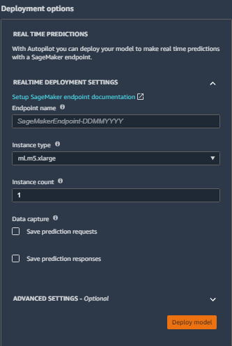
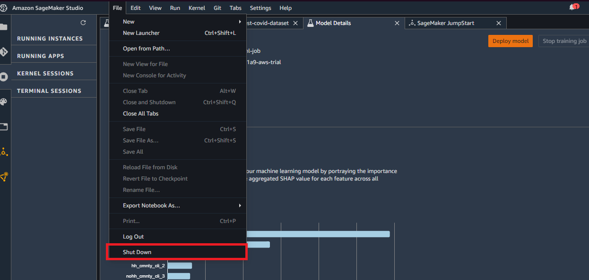

# Amazon SageMaker Autopilot

Amazon SageMaker Autopilot 是一個很方便的工具，它會自動化分析資料、處理資料、選擇適合資料的演算法、訓練模型、調整模型的 **hyperparameters** 、**交叉驗證 (cross-validation)** 模型，此外，它還會自動產生資料探勘與候選演算法的筆記本 (.ipynb)，再加上最後整個 Autopilot 都結束後會產生的資料解釋報告。簡單來說，你只要給這個 Autopilot 一組資料，設置好你所 target 的 feature，它就會自動化產生一個訓練好的模型與關於資料與資料處理流程的報告給你，對於一個不會 ML 的人來說也能很好的應用

不過這麼方便的工具還是有限制的，它只能應用在數據回歸或是分類任務上，遇到影像、文字或是其他 sequence-based 任務 (模型輸出長度不一定的任務) 就無法使用了，另外它也不能指定去使用 pre-trained model (別人訓練過、在某些任務結果有保證的模型) 與你的數據不能有太多數據遺失的情形

下面我就先基本介紹一下 Amazon SageMaker Studio 然後在 Amazon SageMaker Studio 上面做一個 Autopilot 實際應用範例

## SageMaker Studio 基本介紹

要使用 SageMaker Studio，請先去 AWS console 點選 **Amazon SageMaker** 下的 **Amazon SageMaker Studio** ，然後在 SageMaker Studio 的控制台新增使用者，當然如果已經有看到使用者可以直接開他的 Studio，不過不建議因為那可能是別人的，新增使用者只要輸入名稱與執行角色即可，完成後會開始建置 Studio 需要一些時間，下次要用的時候直接用創好的使用者就好， code 跟資料都會存在上面。Studio 建置完就可以按下 **開啟 Studio**，開啟 Studio 也是需要一些時間，值得一提的是 Studio 這個東西跟 SageMaker Notebook instance 不太一樣，NB instance 只要它沒有在 Stopped 的狀態下就算沒有在跑運算也是會被收費的，但是 SageMaker Studio 你開著確認 instance 沒有在跑，就不會被收費

開啟後會到以下畫面

這個框起來的地方可以很好監控 Studio 裡面的資源，建議如果沒有在跑運算就從這邊 shutdown 以避免產生額外費用

### 創建 SageMaker Studio Notebook
我們從 Launcher 頁面下 **Notebooks and compute resources** 選擇 **SageMaker image**，這是選擇跑 Jupyter notebook 的資源，所以選越好費用越多，這裡我們示範選 **Data Science** 就好

創建好後要等 notebook 的 kernel 連線
連線好左下角會寫 **Python 3 (Data Science)| Idle**

可以在監控資源的地方看到我們現在有在跑資源了

如果想要寫 code 時不想耗費運算資源
可以在 notebook 右上方點選現在 kernel 選 No Kernel
寫完 code 在連回 kernel 就可以了

關於更多介紹可以[參考](https://docs.aws.amazon.com/sagemaker/latest/dg/studio.html)

## Autopilot 實際應用範例

## 資料準備

範例需要用的資料來源為 [Delphi's covid-19 dataset](https://delphi.cmu.edu/covidcast/surveys/)，我們使用的資料是 2020 年的某三天美國關於 covid-19 做民調的資料，其中我們的任務是在被給予某地區所在州與某地區前兩天民調的一些狀態百分比，預測第三天篩檢呈陽性的百分比
這裡簡單看一下資料的 feature 有哪些

由於要使用 SageMaker Autopilot 前，資料必須是在 S3 bucket 中的，我們直接用 repo 中的 [covid.train.csv](./covid.train.csv)，下載完畢再手動上傳至 S3 bucket 就好，要注意 Autopilot 有一個要求就是各 feature 的名稱必須唯一，也就是這個.csv檔中的第一個  row，這組資料集已經有符合這個需求

    AL	AK	AZ	AR	CA	CO	CT	FL	GA	ID	IL	IN	IA	KS	KY	LA	MD	MA	MI	MN	MS	MO	NE	NV	NJ	NM	NY	NC	OH	OK	OR	PA	RI	SC	TX	UT	VA	WA	WV	WI	cli_3	ili_3	hh_cmnty_cli_3	nohh_cmnty_cli_3	wearing_mask_3	travel_outside_state_3	work_outside_home_3	shop_3	restaurant_3	spent_time_3	large_event_3	public_transit_3	anxious_3	depressed_3	felt_isolated_3	worried_become_ill_3	worried_finances_3	tested_positive_3	cli_2	ili_2	hh_cmnty_cli_2	nohh_cmnty_cli_2	wearing_mask_2	travel_outside_state_2	work_outside_home_2	shop_2	restaurant_2	spent_time_2	large_event_2	public_transit_2	anxious_2	depressed_2	felt_isolated_2	worried_become_ill_2	worried_finances_2	tested_positive_2	cli	ili	hh_cmnty_cli	nohh_cmnty_cli	wearing_mask	travel_outside_state	work_outside_home	shop	restaurant	spent_time	large_event	public_transit	anxious	depressed	felt_isolated	worried_become_ill	worried_finances	tested_positive

這部分當然也可以不手動下載而在 SageMaker Studio 裡的 Notebook 運行，詳細方法可以參考[這裡](https://gitlab.com/juliensimon/amazon-studio-demos/blob/master/dataset.ipynb)，其流程就是先下載資料至 Studio 中再用 SageMaker Python SDK 上傳到 S3 bucket 上面。如果要使用這種方法可以用 [kaggle](https://www.kaggle.com/c/ml2021spring-hw1/data) 在 Notebook 中下載資料集，詳細方法可以[參考](https://github.com/Kaggle/kaggle-api)，不過要注意這個 kaggle 網址下載的資料集 feature 名稱不唯一，需要自己再改一下 feature 名稱

## 開始 Autopilot

資料上傳到 S3 bucket 後，也不用像一般自己去訓練時去分割什麼 training set 或是 validation set 了，就直接整包丟入 Autopilot 它會幫你處理

在 Launcher 頁面下點選 **New autopilot experiment**

如果要重新叫 Launcher 頁面可以從左上角 **File** 選 **New Launcher**

開完後會看到設置 experiment 的介面

這邊就對這個 experiment 取一個名稱、project 不用選、指定資料在 S3 bucket 上的位置、選擇不是 manifest 的 file 後，就可以在 Target 這個選項看到可以自由選擇之前在 S3 bucket 上傳資料的 feature

下面再選在 S3 bucket 中要 output 結果的位置

這裡的 **[machine learning problem type](https://docs.aws.amazon.com/sagemaker/latest/dg/autopilot-problem-types.html)** 我們示範是數值的預測因此是選 Regression

但是也是可以選擇 Auto 給它自己判斷它的任務

Objective metric 回歸的話只能選 **MSE** 也就是 **mean square error**，是一個常見衡量 regression 模型好壞的參數

若是分類任務一般都選 **Accuracy** 就好

下面 **Do you want to run a complete experiment?** 的意思是如果今天你想要有產出 model 的話就選 是，但是如果只是想要分析資料與讓 Autopilot 推薦演算法的話就可以選 否

Auto Deploy 如果選的話它 Autopilot 結束就會直接幫你把它產出最好的 model 拿去做端點，這邊不選後面有 model 後也可以在 Studio 上一鍵設端點

接下來按下 **Create Experiment** 就會開始 Autopilot，會到下面這個畫面，這裡就代表成功開始了

圖中可以看到 Autopilot 的流程主要是:

* Pre-processing
* Candidate Definitions Generated
* Feature Engineering
* Model Tuning
* Explainibility Report Generated

前三個階段結束時就會有兩個它幫你產生的 Notebook，會在

這區域附近產生

這樣的按鈕，按下就能在 Studio 中開啟

[DataExplorationNotebook](./SageMakerAutopilotDataExplorationNotebook.ipynb) 主要是對資料做一點簡單分析

而 [CandidateDefinitionNotebook](./SageMakerAutopilotCandidateDefinitionNotebook.ipynb) 就是列
出建議的資料處理與演算法，並且開始訓練與自動化調整 **hyperparameters**

Autopilot experiment 全部完成後，以上兩個 Notebook 也會存在之前設置 experiment 的 output 下的

    {你的 experiment 名稱}/sagemaker-automl-candidates/{你的資料集名稱}/notebooks/ 

簡單來說，這兩個 Notebook 就是 Autopilot 執行的詳細內容。如果你只是想把 Autopilot 當成是一個黑盒子看，就是你只需要把資料丟進去，然後它丟一個模型出來，那可以不用管這兩個 Notebook; 但是如果你想要知道 Autopilot 中的流程與分析方法，這兩個 Notebook 可以給很多的 insight，而且如果想要在這整個產出模型的流程中增加一些自己的 code 也可以在這兩個 notebook 中加自己的 code，加完以後執行 notebook 即可

此外，也會在設置的 output 下的

    {你的 experiment 名稱}/documentation/explainability/output/{你的資料集名稱}/ 

下面找到 [report](./report.ipynb) 檔案

其詳細內容為列出前十個跟 target 最相關的 feature

至於 Autopilot 開始到完畢要多少時間基本上要看任務內容與資料的多寡

這邊跑示範的時候是使用 [2700 個 row 的資料](./covid.train.csv)，到全部完成差不多跑了兩三個小時

如果想要監控模型訓練階段或是 hyperparameters tuning 的進程

可以去 SageMaker 的儀表板看整個 Autopilot 會用到的資源

Hyperparameter 調教要蠻久的，而且會產生很多訓練任務，我跑範例是產生 250 個訓練任務，已經達到預設的上限，在儀表板上 **Hyperparameter 調教任務** 點選建立的任務中 **調教任務組態** 可以看到資源限制

訓練完後可以看到以下畫面

可以看到它產出最好的模型 MSE 約為 0.95

## 模型內容與端點設置

由 Autopilot 產生的 model 建議用設置端點來做 inference

因為它不是單單產出一個輸入原始數據產生結果的 model

它產出的是包含資料與特徵處理融合 model 的 dataflow

如果想要看 model 內部詳細內容，可以如圖

再選 **Artifacts**
可以看到詳細的 dataflow 處理程序跟 model 在 S3 的存放位置
如果真的想要把 model 自己用別種方法做 inference 可以參照這裡提供的方向進行

可以選擇模型後按右邊橘色按鈕 **Deploy model** 設置端點

下面就選一下端點名稱、要 host 端點的硬體跟數量

用端點的一個好處是 **Save prediction requests/responses** 可以直接在這邊設置，設置的話要指定一個 S3 存點，這樣只要有資料透過這端點做 inference，就會自動存下這些資料或模型輸出結果，所以就可以用這些資料之後用來訓練模型或是作為其他用途

## 測試模型

在實際應用上，從上面的步驟做完產出模型後就能直接運用模型了

而測試模型這步已經包含在 Autopilot 裡面，也就是這邊的數據

不過這個資料集在[這個課程](https://speech.ee.ntu.edu.tw/~hylee/ml/2021-spring.html)上的 hw1 有另外提供一個沒有給 "test_positive" 的 [test dataset](./covid.test.csv)，用其做 inference 預測 "test_positive" 可以在 [kaggle](https://www.kaggle.com/c/ml2021spring-hw1/leaderboard) 上面上傳結果，來看一下這個 model 的程度在哪

所以我另外在 Amazon SageMaker Studio 上面創建了一個 [Notebook](./test.ipynb) 來產生符合能上傳至[這個 kaggle competition](https://www.kaggle.com/c/ml2021spring-hw1/leaderboard) 的形式([範例](./sampleSubmission.csv))

也可以順便當作使用 **Endpoint 端點**的範例

這邊是在 SageMaker Studio 上面跑的，這邊可以當作先宣告一個有權限使用端點的使用者

    import boto3,sys

    sm_rt = boto3.Session().client('runtime.sagemaker')

這邊就是先宣告要使用的 Endpoint 名子，如果之前端點有創建成功

可以去 AWS SageMaker 上 **推論** **端點** 看到端點

    ep_name = 'SageMaker-AutoPilot-Test-20210727'

下面這邊就是把要測試的資料一個 row 一個 row 的丟進端點並存取結果成一個.csv檔，結果在[這裡](./predict.csv)

    import csv
    with open('predict.csv', 'w') as fp:
        writer = csv.writer(fp)
        writer.writerow(['id', 'tested_positive'])
        with open('covid.test.csv') as f:
            lines = f.readlines()
            for l in lines[1:]:   # Skip header
                l = l.split(',')  # Split CSV line into features
                iD = l[0]
                l = l[1:]
                l = ','.join(l)   # Rebuild CSV line without label
                response = sm_rt.invoke_endpoint(EndpointName=ep_name, ContentType='text/csv', Accept='text/csv', Body=l)
                response = response['Body'].read().decode("utf-8")
                writer.writerow([iD, response])
        #         print(response)

最後就把這個 predict.csv 上傳至 kaggle 的 competition，結果如下

這邊 Private/Public score 不用太糾結意思，做出這兩個 score 的區別只是因為當初評分要用的一些差異，跟 ML 沒啥關係

這個模型的 Private score 是有過這個 competition 訂下來的 medium baseline，同樣這個 baseline 也跟 ML 沒啥關係，只是當初評分要用的

這個成績還算可以，能說是堪用，至少對於一個沒有 ML 經驗的人可以產生這個 model 算是很好了

## 提醒

如果有實際做完這個測試，完成後請記得

* 去 SageMaker **推論** **端點** 跟 **端點組態** 刪除端點跟組態否則端點會持續產生費用
* 不用 SageMaker Studio 時，點擊紅圈這邊，在此圖左邊這邊確定資源空的，沒有在用

確認完後就能 **File** **Shut Down** 然後 **Shut Down All**

裡面的資料都會被保存

下次要繼續作業開啟 Studio 就可以了

## Studio 刪除

Studio 如果沒資源在跑，且裡面沒有佔用太多空間基本上不會有費用

但是如果真的想要把 Studio 刪除

可以點選使用者

如果下面 **應用程式** 都沒在運作就能 **刪除使用者**

只要所有使用者都被刪除

就能點選 **刪除 Studio** 了
